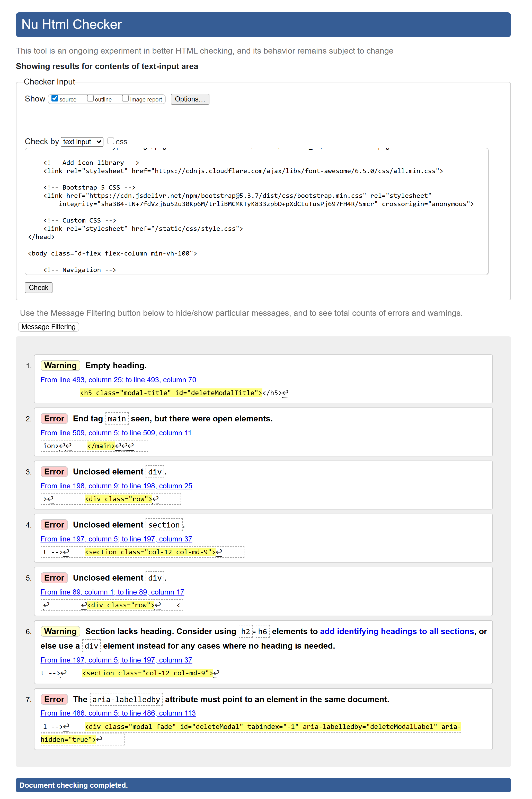
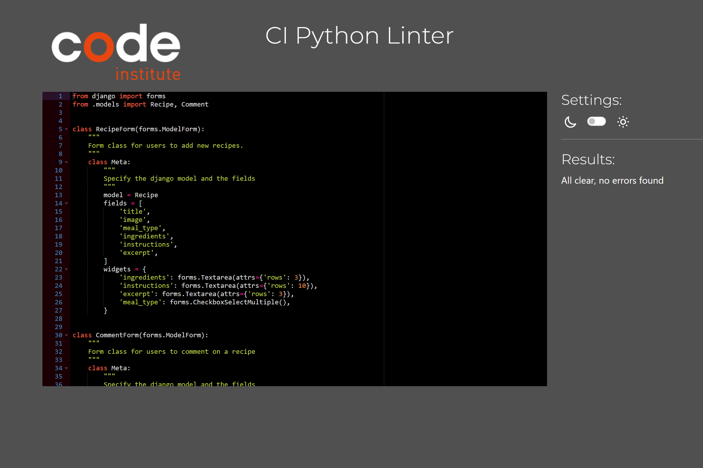
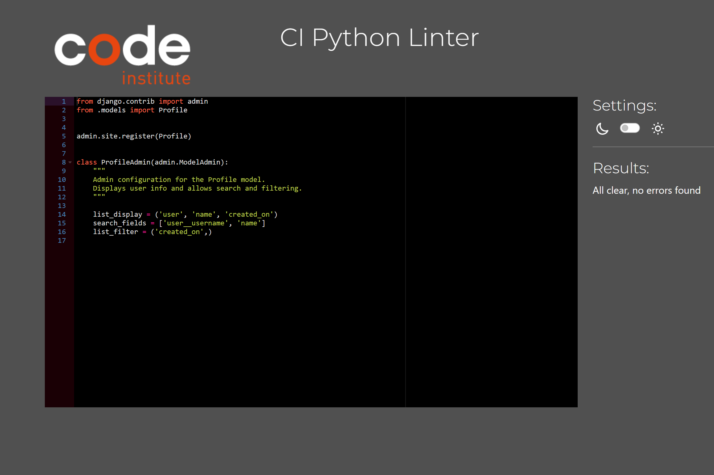
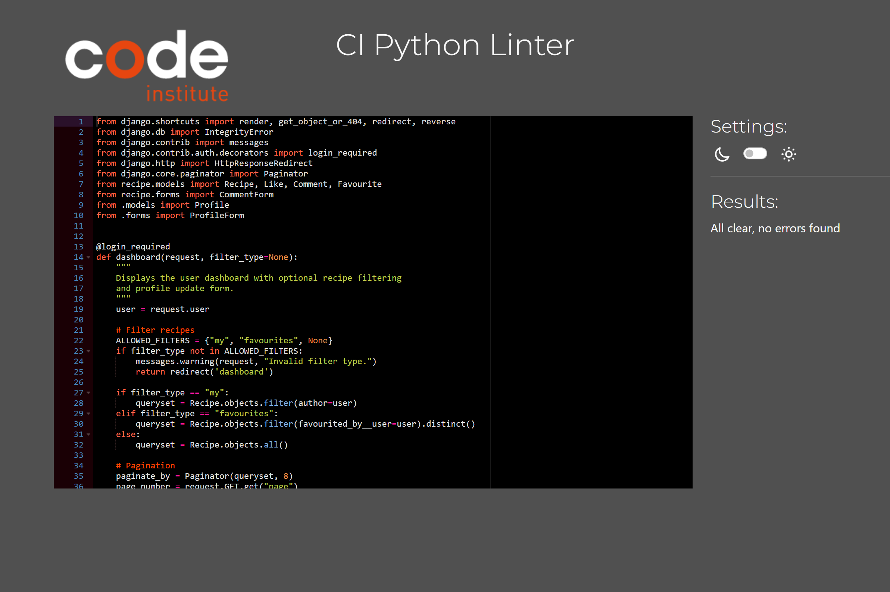
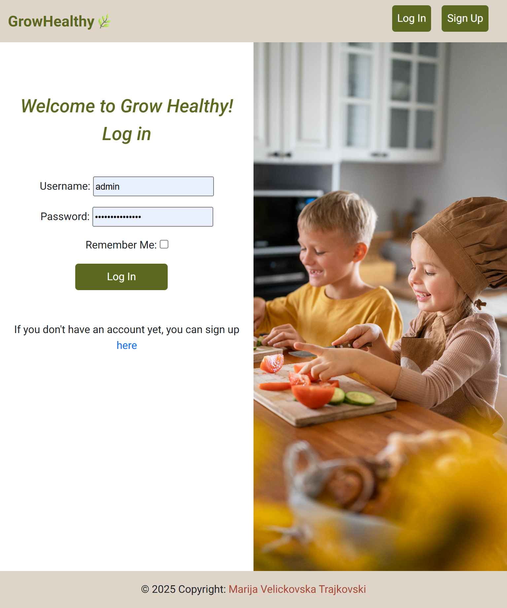
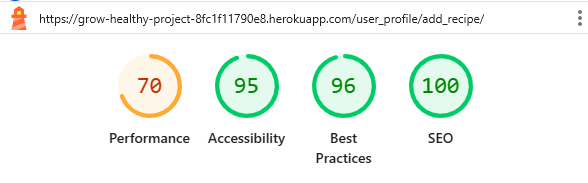

# Testing

> [!NOTE]
> Return back to the [README.md](README.md) file.

## Code Validation

### HTML

I have used the recommended [HTML W3C Validator](https://validator.w3.org) to validate all of my HTML files.

| Directory | File | Screenshot | Notes |
| --- | --- | --- | --- |
| home | [home.html](https://github.com/marijavelickovska/grow_healthy/blob/main/home/templates/home/home.html) |  | Notes (if applicable) |
| user_profile | [dashboard.html](https://github.com/marijavelickovska/grow_healthy/blob/main/user_profile/templates/user_profile/dashboard.html) |  | Notes (if applicable) |
| user_profile | [recipe_detail.html](https://github.com/marijavelickovska/grow_healthy/blob/main/user_profile/templates/user_profile/recipe_detail.html) |  | During testing, 6 errors and 1 warning appear on recipe_detail.html, but these issues do not originate directly from this page. The reason is that recipe_detail.html extends (), and dashboard.html passes without errors when tested separately. |
| user_profile | [add_recipe.html](https://github.com/marijavelickovska/grow_healthy/blob/main/user_profile/templates/user_profile/add_recipe.html) |  | During testing, 4 errors appear on add_recipe.html, but these errors do not originate directly from this page. The reason is that add_recipe.html extends (), and dashboard.html passes without errors when tested separately. |
| templates | [404.html](https://github.com/marijavelickovska/grow_healthy/blob/main/templates/404.html) |  | Notes (if applicable) |

### CSS

I have used the recommended [CSS Jigsaw Validator](https://jigsaw.w3.org/css-validator) to validate all of my CSS files.

| Directory | File | URL | Screenshot |  Notes |
| --- | --- | --- | --- | --- |
| static | [style.css](https://github.com/marijavelickovska/grow_healthy/blob/main/static/css/style.css) | [link](https://jigsaw.w3.org/css-validator/validator) |  | 

### JavaScript

I have used the recommended [JShint Validator](https://jshint.com) to validate all of my JS files.

| Directory | File | URL | Screenshot | Notes |
| --- | --- | --- | --- | --- |
| static | [script.js](https://github.com/marijavelickovska/grow_healthy/blob/main/static/js/script.js) | N/A |  |

### Python

I have used the recommended [PEP8 CI Python Linter](https://pep8ci.herokuapp.com) to validate all of my Python files.

| Directory | File | URL | Screenshot | Notes |
| --- | --- | --- | --- | --- |
| grow_healthy | [settings.py](https://github.com/marijavelickovska/grow_healthy/blob/main/grow_healthy/settings.py) | [PEP8 CI Link](https://pep8ci.herokuapp.com/https://raw.githubusercontent.com/marijavelickovska/grow_healthy/main/grow_healthy/settings.py) |  | Notes (if applicable) |
| grow_healthy | [urls.py](https://github.com/marijavelickovska/grow_healthy/blob/main/grow_healthy/urls.py) | [PEP8 CI Link](https://pep8ci.herokuapp.com/https://raw.githubusercontent.com/marijavelickovska/grow_healthy/main/grow_healthy/urls.py) |  | Notes (if applicable) |
| home | [urls.py](https://github.com/marijavelickovska/grow_healthy/blob/main/home/urls.py) | [PEP8 CI Link](https://pep8ci.herokuapp.com/https://raw.githubusercontent.com/marijavelickovska/grow_healthy/main/home/urls.py) |  | Notes (if applicable) |
| home | [views.py](https://github.com/marijavelickovska/grow_healthy/blob/main/home/views.py) | [PEP8 CI Link](https://pep8ci.herokuapp.com/https://raw.githubusercontent.com/marijavelickovska/grow_healthy/main/home/views.py) |  | Notes (if applicable) |
| recipe | [test_forms.py](https://github.com/marijavelickovska/grow_healthy/blob/main/recipe/tests/test_forms.py) | [PEP8 CI Link](https://pep8ci.herokuapp.com/https://raw.githubusercontent.com/marijavelickovska/grow_healthy/refs/heads/main/recipe/tests/test_forms.py) |  | Notes (if applicable) |
| recipe | [test_views.py](https://github.com/marijavelickovska/grow_healthy/blob/main/recipe/tests/test_views.py) | [PEP8 CI Link](https://pep8ci.herokuapp.com/https://raw.githubusercontent.com/marijavelickovska/grow_healthy/refs/heads/main/recipe/tests/test_views.py) |  | Notes (if applicable) |
| recipe | [admin.py](https://github.com/marijavelickovska/grow_healthy/blob/main/recipe/admin.py) | [PEP8 CI Link](https://pep8ci.herokuapp.com/https://raw.githubusercontent.com/marijavelickovska/grow_healthy/main/recipe/admin.py) |  | Notes (if applicable) |
| recipe | [forms.py](https://github.com/marijavelickovska/grow_healthy/blob/main/recipe/forms.py) | [PEP8 CI Link](https://pep8ci.herokuapp.com/https://raw.githubusercontent.com/marijavelickovska/grow_healthy/main/recipe/forms.py) |  | Notes (if applicable) |
| recipe | [models.py](https://github.com/marijavelickovska/grow_healthy/blob/main/recipe/models.py) | [PEP8 CI Link](https://pep8ci.herokuapp.com/https://raw.githubusercontent.com/marijavelickovska/grow_healthy/main/recipe/models.py) |  | Notes (if applicable) |
| recipe | [views.py](https://github.com/marijavelickovska/grow_healthy/blob/main/recipe/views.py) | [PEP8 CI Link](https://pep8ci.herokuapp.com/https://raw.githubusercontent.com/marijavelickovska/grow_healthy/main/recipe/views.py) |  | Notes (if applicable) |
| user_profile | [test-forms.py](https://github.com/marijavelickovska/grow_healthy/blob/main/user_profile/tests/test_forms.py) | [PEP8 CI Link](https://pep8ci.herokuapp.com/https://raw.githubusercontent.com/marijavelickovska/grow_healthy/refs/heads/main/user_profile/tests/test_forms.py) |  | Notes (if applicable) |
| user_profile | [test-views.py](https://github.com/marijavelickovska/grow_healthy/blob/main/user_profile/tests/test_views.py) | [PEP8 CI Link](https://pep8ci.herokuapp.com/https://raw.githubusercontent.com/marijavelickovska/grow_healthy/refs/heads/main/user_profile/tests/test_views.py) |  | Notes (if applicable) |
| user_profile | [admin.py](https://github.com/marijavelickovska/grow_healthy/blob/main/user_profile/admin.py) | [PEP8 CI Link](https://pep8ci.herokuapp.com/https://raw.githubusercontent.com/marijavelickovska/grow_healthy/main/user_profile/admin.py) |  | Notes (if applicable) |
| user_profile | [context_processors.py](https://github.com/marijavelickovska/grow_healthy/blob/main/user_profile/context_processors.py) | [PEP8 CI Link](https://pep8ci.herokuapp.com/https://raw.githubusercontent.com/marijavelickovska/grow_healthy/main/user_profile/context_processors.py) |  | Notes (if applicable) |
| user_profile | [forms.py](https://github.com/marijavelickovska/grow_healthy/blob/main/user_profile/forms.py) | [PEP8 CI Link](https://pep8ci.herokuapp.com/https://raw.githubusercontent.com/marijavelickovska/grow_healthy/main/user_profile/forms.py) |  | Notes (if applicable) |
| user_profile | [models.py](https://github.com/marijavelickovska/grow_healthy/blob/main/user_profile/models.py) | [PEP8 CI Link](https://pep8ci.herokuapp.com/https://raw.githubusercontent.com/marijavelickovska/grow_healthy/main/user_profile/models.py) |  | Notes (if applicable) |
| user_profile | [urls.py](https://github.com/marijavelickovska/grow_healthy/blob/main/user_profile/urls.py) | [PEP8 CI Link](https://pep8ci.herokuapp.com/https://raw.githubusercontent.com/marijavelickovska/grow_healthy/main/user_profile/urls.py) |  | Notes (if applicable) |
| user_profile | [views.py](https://github.com/marijavelickovska/grow_healthy/blob/main/user_profile/views.py) | [PEP8 CI Link](https://pep8ci.herokuapp.com/https://raw.githubusercontent.com/marijavelickovska/grow_healthy/main/user_profile/views.py) |  | Notes (if applicable) |

## Responsiveness

I've tested my deployed project to check for responsiveness issues.

| Page | Mobile | Tablet | Desktop | Notes |
| --- | --- | --- | --- | --- |
| Home |  |  |  | Works as expected |
| Signup |  |  |  | Works as expected |
| Login |  |  |  | Works as expected |
| Dashboard |  |  |  | Works as expected |
| Recipe Detail |  |  |  | Works as expected |
| Add Recipe |  |  |  | Works as expected |
| 404 |  |  |  | Works as expected |

## Browser Compatibility

I've tested my deployed project on multiple browsers to check for compatibility issues.

| Page | Chrome | Firefox | Edge | Notes |
| --- | --- | --- | --- | --- |
| Home |  |  |  | Works as expected |
| Signup |  |  |  | Works as expected |
| Login |  |  |  | Works as expected |
| Dashboard |  |  |  | Works as expected |
| Recipe Detail |  |  |  | Works as expected |
| Add Recipe |  |  |  | Works as expected |
| 404 |  |  |  | Works as expected |

## Lighthouse Audit

I've tested my deployed project using the Lighthouse Audit tool to check for any major issues. Some warnings are outside of my control, and mobile results tend to be lower than desktop.

| Page | Mobile | Desktop |
| --- | --- | --- |
| Home |  |  |
| Signup |  |  |
| Login |  |  |
| Dashboard |  |  |
| Recipe Detail |  |  |
| Add Recipe |  |  |
| 404 |  |  |

## Defensive Programming

Defensive programming was manually tested with the below user acceptance testing:

| Page | Expectation | Test | Result | Screenshot |
| --- | --- | --- | --- | --- |
| Home | When a non-logged-in user clicks on a recipe, they should not be able to access the recipe details. Instead, they should be informed that they need to log in to view the recipe details. | Clicked on a recipe while not logged in. | The page scrolled down to the "Join us" section and displayed the message: "To see the recipe details, please log in or sign up." |  |
| Dashboard | After successful login, the user should be redirected to the dashboard. Their profile name should appear in the navbar, and a success message should be displayed below the navbar. | Logged in with valid user credentials. | User was redirected to the dashboard. The navbar showed "Hello [username]", and a success message appeared below the navbar. |  |
| | When clicking the edit button, the disabled fields (name, about me, and profile picture) should become enabled for editing. After clicking save, the updated information should be saved successfully. | Clicked the edit button, modified the name, about me, and profile picture fields, then clicked save. | The fields were enabled after clicking edit, changes were saved successfully after clicking save. |  |
| | If there are more than 8 recipes, pagination should appear. The correct number of pages should be shown. On the first page, only the "Next" button should be visible; on the last page, only the "Previous" button should be shown. | Added more than 8 recipes to the dashboard and navigated through pages. | Pagination appeared correctly. Page numbers were displayed. The first page showed only the "Next" button, and the last page showed only the "Previous" button. |  |
| | On clicking "My Recipes" in the sub-navbar, only the recipes added by the logged-in user should be displayed. | Clicked "My Recipes" in the sub-navbar. | Only the user's own recipes were displayed correctly. |  |
| | On clicking "Favourites" in the sub-navbar, only the recipes marked as favourite by the user should be displayed. | Clicked "Favourites" in the sub-navbar. | Only the user's favourite recipes were displayed correctly. |  |
| | Each recipe card should display icons for like, comment, and favourites. Clicking the like icon should increase the like count and highlight the icon; clicking again should undo the like. Clicking the comment icon should navigate to the recipe detail page with the comments section. Clicking the favourites icon should turn it red to indicate it is saved; clicking again should remove it from favourites and reset the icon color. After each action, the user should be notified with a success message. | Clicked like – icon highlighted and count increased; clicked again – count decreased and icon reset. Clicked comment – navigated to recipe detail with comments visible. Clicked favourites – icon turned red; clicked again – icon reset. After each click, a success message was displayed to confirm the action. | All three icons functioned correctly with appropriate actions, visual feedback, and success messages. |  |
| Recipe Detail | When a logged-in user clicks on a recipe, the recipe details should open and display all necessary fields such as image, title, meal type, ingredients, instructions, creator, date, comments, a form to add comments, and edit/delete buttons for both the recipe and comments if they belong to the logged-in user. Otherwise, the edit/delete buttons should not be visible. | Logged in as a user and clicked on a recipe. Verified the display of all recipe details and the visibility of edit/delete buttons only on user-owned content. | Recipe details displayed correctly. Edit and delete buttons appeared only for the recipe and comments owned by the logged-in user. |  |
| | On clicking the edit icon, the edit recipe form should open. Upon submitting valid changes, the recipe should be successfully updated and a confirmation message should be displayed. | Clicked "Edit Recipe", modified title and ingredients, then submitted the form. | The recipe was successfully updated and a "Recipe successfully updated." message appeared. |  |
| | On clicking the delete icon, a confirmation modal should appear. Upon clicking delete, the recipe should be successfully deleted and a success message should be displayed. | Clicked the delete icon, confirmed the deletion in the modal. | The recipe was successfully deleted and a "Receptot e uspesno izbrisan" message appeared. |  |
| | Clicking on the author's name (next to "Created by" in the recipe section and in the comments) should open a modal showing the author's information including their profile picture, name, and about section. | Clicked the author's name in both the recipe and comment sections. | A modal appeared displaying the creator's profile image, full name, and about info. |  |
| | Clicking the edit icon on a recipe should open the edit form populated with the recipe's existing data. After correctly filling in the form and submitting, the recipe should be updated and a success message should be displayed. | Clicked the edit icon – form opened with pre-filled data. Modified fields and submitted. | Recipe was successfully updated and a "Recipe successfully updated" message appeared. |  |
| | If the logged-in user clicks the delete icon on one of their own recipes, the recipe should be deleted and a success message should be shown. | Clicked the delete icon on a recipe owned by the logged-in user. | Recipe was successfully deleted and a "Recipe was successfully deleted" message appeared. |  |
| | Below the recipe details, there is a comments section displaying all existing comments and a form to add a new one. On submitting the form, a new comment should be successfully added. For comments authored by the currently logged-in user, edit and delete icons should appear. Clicking edit allows the comment to be updated; clicking delete removes the comment. After each action, a success message should be displayed. | Submitted a new comment – it appeared in the list. On an existing comment owned by the logged-in user, clicked edit – updated comment was saved and message shown. Clicked delete – comment was removed and confirmation message appeared. | Add, edit, and delete actions worked correctly with appropriate UI updates and success messages for each. |  |
| Add Recipe | If the user tries to submit the add recipe form without filling in one or more required fields, the form should not submit and validation messages should be displayed indicating which fields are required. | Opened the add recipe page, left required fields empty, and clicked submit. | Form was not submitted. Validation messages appeared next to the empty required fields indicating they are mandatory. |  |
| | On correctly filling all required fields and submitting the form, the recipe should be saved, displayed in "My Recipes", and a success message "Recipe added successfully" should be shown. | Filled in all required fields and submitted the form. | Recipe was added successfully, appeared in "My Recipes", and a success message was shown. |  |
| 404 Error Page | Feature is expected to display a 404 error page for non-existent pages. | Navigated to an invalid URL (e.g., `/test`). | A custom 404 error page was displayed as expected. |  |

## User Story Testing

| Target | Expectation | Outcome | Screenshot |
| --- | --- | --- | --- |
| As a blog owner | I would like to create new blog posts with a title, featured image, and content | so that I can share my experiences with my audience. |  |
| As a blog owner | I would like to update existing blog posts | so that I can correct or add new information to my previous stories. |  |
| As a blog owner | I would like to delete blog posts | so that I can remove outdated or irrelevant content from my blog. |  |
| As a blog owner | I would like to retrieve a list of all my published blog posts | so that I can manage them from a central dashboard. |  |
| As a blog owner | I would like to preview a post as draft before publishing it | so that I can ensure formatting and content appear correctly. |  |
| As a blog owner | I would like to review comments before they are published | so that I can filter out spam or inappropriate content. |  |
| As a blog owner | I would like to approve or reject comments from users | so that I can maintain control over the discussion on my posts. |  |
| As a blog owner | I would like to view a list of all comments (both approved and pending) | so that I can manage user engagement effectively. |  |
| As a blog owner | I would like to edit or delete user comments | so that I can clean up or remove inappropriate responses after they've been posted. |  |
| As a registered user | I would like to log in to the site | so that I can leave comments on blog posts. |  |
| As a registered user | I would like to register for an account | so that I can become part of the community and engage with the blog. |  |
| As a registered user | I would like to leave a comment on a blog post | so that I can share my thoughts or ask questions about the owner's experiences. |  |
| As a registered user | I would like my comment to show my name and the timestamp | so that others can see who I am and when I left the comment. |  |
| As a registered user | I would like to receive a notification or message saying my comment is pending approval | so that I understand it hasn't been posted immediately. |  |
| As a registered user | I would like to edit or delete my own comments | so that I can fix mistakes or retract my statement. |  |
| As a guest user | I would like to read blog posts without registering | so that I can enjoy the content without needing to log in. |  |
| As a guest user | I would like to browse past posts | so that I can explore the blog's full content history. |  |
| As a guest user | I would like to register for an account | so that I can participate in the community by leaving comments on posts. |  |
| As a guest user | I would like to see the names of other commenters on posts | so that I can get a sense of community interaction before registering. |  |
| As a user | I would like to see a 404 error page if I get lost | so that it's obvious that I've stumbled upon a page that doesn't exist. |  |

## Automated Testing

I have conducted a series of automated tests on my application.

> [!NOTE]
> I fully acknowledge and understand that, in a real-world scenario, an extensive set of additional tests would be more comprehensive.

### Python (Unit Testing)

⚠️ INSTRUCTIONS ⚠️

Adjust the code below (file names, function names, etc.) to match your own project files/folders. Use these notes loosely when documenting your own Python Unit tests, and remove/adjust where applicable.

⚠️ SAMPLE ⚠️

I have used Django's built-in unit testing framework to test the application functionality. In order to run the tests, I ran the following command in the terminal each time:

- `python3 manage.py test name-of-app`

To create the coverage report, I would then run the following commands:

- `pip3 install coverage`
- `pip3 freeze --local > requirements.txt`
- `coverage run --omit=*/site-packages/*,*/migrations/*,*/__init__.py,env.py,.env manage.py test`
- `coverage report`

To see the HTML version of the reports, and find out whether some pieces of code were missing, I ran the following commands:

- `coverage html`
- `python3 -m http.server`

Below are the results from the full coverage report on my application that I've tested:

#### Unit Test Issues

⚠️ INSTRUCTIONS ⚠️

Use this section to list any known issues you ran into while writing your Python unit tests. Remember to include screenshots (where possible), and a solution to the issue (if known). This can be used for both "fixed" and "unresolved" issues. Remove this sub-section entirely if you somehow didn't run into any issues while working with your tests.

⚠️ --- END --- ⚠️

## Bugs

⚠️ INSTRUCTIONS ⚠️

Nobody likes bugs,... except the assessors! Projects seem more suspicious if a student doesn't properly track their bugs. If you're about to submit your project without any bugs listed below, you should ask yourself why you're doing this course in the first place, if you're able to build this entire application without running into any bugs. The best thing you can do for any project is to document your bugs! Not only does it show the true stages of development, but think of it as breadcrumbs for yourself in the future, should you encounter the same/similar bug again, it acts as a gentle reminder on what you did to fix the bug.

If/when you encounter bugs during the development stages of your project, you should document them here, ideally with a screenshot explaining what the issue was, and what you did to fix the bug.

Alternatively, an improved way to manage bugs is to use the built-in **[Issues](https://www.github.com/marijavelickovska/grow_healthy/issues)** tracker on your GitHub repository. This can be found at the top of your repository, the tab called "Issues".

If using the Issues tracker for bug management, you can simplify the documentation process for testing. Issues allow you to directly paste screenshots into the issue page without having to first save the screenshot locally. You can add labels to your issues (e.g. `bug`), assign yourself as the owner, and add comments/updates as you progress with fixing the issue(s). Once you've solved the issue/bug, you should then "Close" it.

When showcasing your bug tracking for assessment, you can use the following examples below.

⚠️ --- END --- ⚠️

### Fixed Bugs

I've used [GitHub Issues](https://www.github.com/marijavelickovska/grow_healthy/issues) to track and manage bugs and issues during the development stages of my project.

All previously closed/fixed bugs can be tracked [here](https://www.github.com/marijavelickovska/grow_healthy/issues?q=is%3Aissue+is%3Aclosed+label%3Abug).

### Unfixed Bugs

⚠️ INSTRUCTIONS ⚠️

You will need to mention any unfixed bugs and why they are not fixed upon submission of your project. This section should include shortcomings of the frameworks or technologies used. Although time can be a big variable to consider, paucity of time and difficulty understanding implementation is not a valid reason to leave bugs unfixed. Where possible, you must fix all outstanding bugs, unless outside of your control.

If you've identified any unfixed bugs, no matter how small, be sure to list them here! It's better to be honest and list them, because if it's not documented and an assessor finds the issue, they need to know whether or not you're aware of them as well, and why you've not corrected/fixed them.

⚠️ --- END --- ⚠️

Any remaining open issues can be tracked [here](https://www.github.com/marijavelickovska/grow_healthy/issues).

### Known Issues

| Issue | Screenshot |
| --- | --- |
| On devices smaller than 375px, the page starts to have horizontal `overflow-x` scrolling. |  |
| When validating HTML with a semantic `<section>` element, the validator warns about lacking a header `h2-h6`. This is acceptable. |  |
| Validation errors on "signup.html" coming from the Django Allauth package. |  |

> [!IMPORTANT]
> There are no remaining bugs that I am aware of, though, even after thorough testing, I cannot rule out the possibility.

